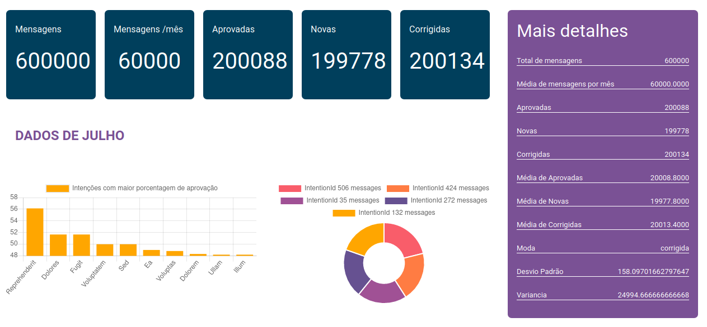

# Desafio Smarkio

## Descrição
Dashboard que consome os dados de um banco de dados relacional através de uma API.

## Tutorial de execução

### 1 - Pré requisitos

  - MySQL
  - NodeJS
  - Algum banco de dados já criado no MySQL
### 2 - Passos

Clone o repositório no seu ambiente local;
\
Entre no diretório do repositório através do comando:

```
$ cd desafio-smarkio
```

Em seguida crie um arquivo .env com o comando:

```
$ cp .env.example .env
```

Isso irá gerar um arquivo .env, onde você deve inserir as suas credenciais do MySQL.


Para instalar as dependências utilizadas, criar as tabelas e popular o banco, respectivamente, utilize digite os seguintes comandos nesta ordem:

```
$ npm install
$ npx sequelize db:migrate
$ npx sequelize db:seed:all
```

###### OBS 1: o seed pode demorar pra executar (2 min aproximadamente), pois a tabela de mensagens está sendo populada com um total de 600000 linhas. 

\
Para gerar o .csv com as mesmas métricas que utilizei execute a query utils/db/estatistica.sql no seu SGDB e exporte o resultado nesse formato e com o nome 'analytics.csv'. Por fim insira esse arquivo na pasta src/public/csv e acesse http://localhost:8080 no seu navegador.

###### OBS 2: Deixei o .csv que eu gerei na pasta mencionada, então mesmo que opte por não usar .csv a tela será exibida sem problemas, mas não com as estatíscas atualizadas.
\


## Considerações

As queries de consulta no banco estão disponibilizadas na pasta 'utils/db', caso deseje realizar as consultas diretamente pelo SGDB. Os índices gerados foram feitos para o atributo 'date' de cada tabela pois era a principal restrição para consulta.
